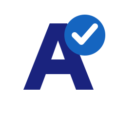

<section class="acessweb-hero" aria-labelledby="acessweb-title">
  

    
Acessibilidade digital · Grupo 03

    <h1 id="acessweb-title" aria-label="AcessWeb">
      AcessWeb
    </h1>
    

      Avaliação de acessibilidade e usabilidade dos sites da Apple e da Samsung,
      fundamentada em critérios WCAG, normas ABNT e heurísticas de Nielsen.
    

    

      <a class="acessweb-button acessweb-button--primary" href="apple/resumo/">
        Explorar avaliações
      </a>
      <a class="acessweb-button" href="comparacao/comparacao/">
        Ver comparação
      </a>
    

  

  

    
  

</section>

## Sobre o projeto

  O <strong>AcessWeb</strong> reúne os resultados do relatório
  <strong>Avaliação dos Sites Samsung e Apple</strong>. O objetivo é identificar
  barreiras, registrar evidências e comparar como cada interface atende às
  necessidades de diferentes pessoas usuárias.

## Explore a avaliação

  <a class="acessweb-card" href="apple/resumo/">
    01 · APPLE
    <strong>Avaliação do site da Apple</strong>
    
Resultados por critérios de acessibilidade, conformidade e usabilidade.

  </a>
  <a class="acessweb-card" href="samsung/resumo/">
    02 · SAMSUNG
    <strong>Avaliação do site da Samsung</strong>
    
Análise das barreiras encontradas e das boas práticas observadas.

  </a>
  <a class="acessweb-card" href="comparacao/comparacao/">
    03 · COMPARAÇÃO
    <strong>Comparação entre os sites</strong>
    
Visão conjunta dos resultados para apoiar a discussão e a conclusão.

  </a>
  <a class="acessweb-card" href="ferramenta/wave/">
    04 · FERRAMENTA
    <strong>Aplicação do WAVE</strong>
    
Avaliação automatizada complementar e interpretação dos alertas.

  </a>

## Informações acadêmicas

| Informação | Descrição |
| --- | --- |
| Disciplina | Interação Humano-Computador |
| Curso | Engenharia de Software |
| Instituição | Universidade de Brasília (UnB) |
| Professora | Rejane Figueiredo |
| Semestre | 1.2026 |
| Equipe | Grupo 03 |

## Equipe

  
Luís Felipe

  
João Pedro

  
Joaquim José

  
Johnnatan de Salles (John)

  
André Henrique

  
Giovanna Felipe

  
Renato Araújo

